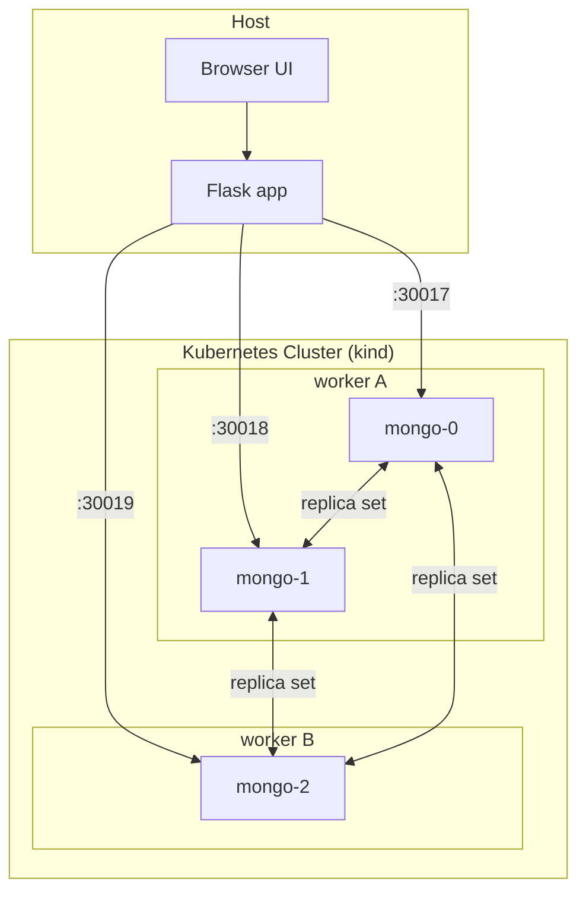
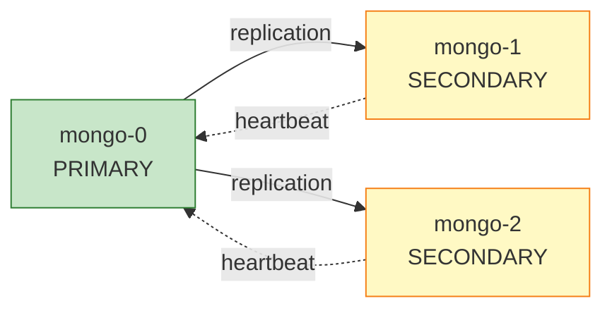
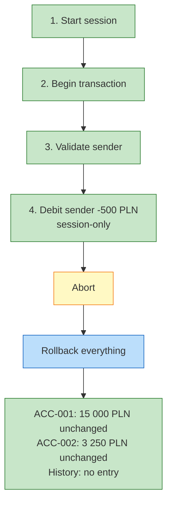
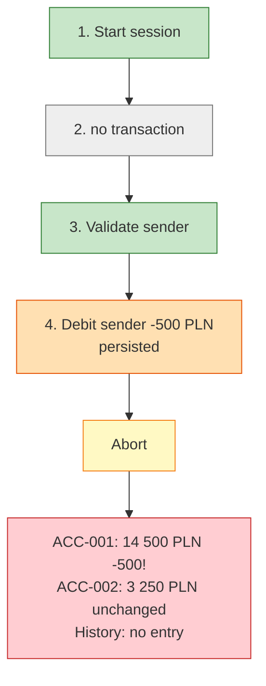
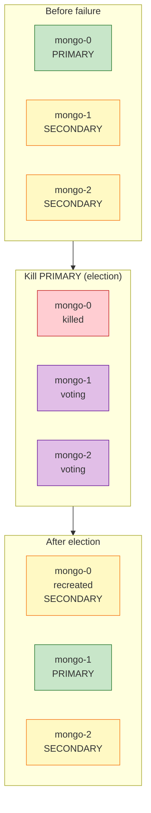
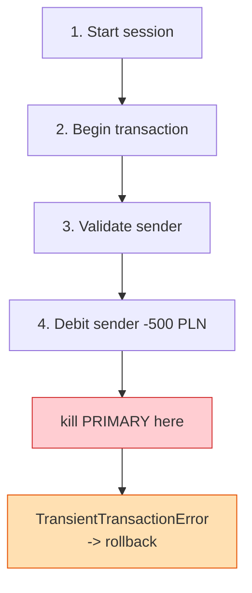
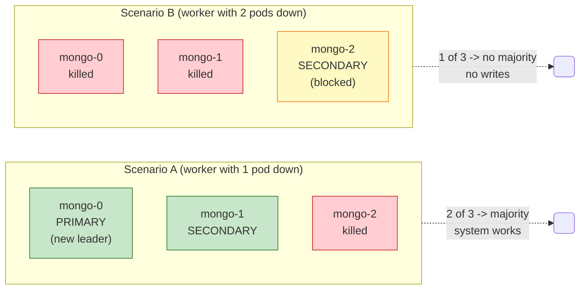

# MongoDB High Availability on Kubernetes

## StatefulSet, Replica Set, ACID

---

## Table of Contents

0. **Prerequisites** — install kind, kubectl, Docker, Python
1. **Introduction** — PostgreSQL vs MongoDB
2. **Kubernetes basics** — Pod, Node, Deployment vs StatefulSet, PV/PVC, Headless Service
3. **Tools: minikube vs kind**
4. **MongoDB HA architecture** — replica set, cluster topology
5. **Building the cluster** — step-by-step setup
6. **MongoBank and ACID** — demo app, `tx` and `no tx` modes
7. **Demo 1** — normal operation
8. **Demo 2** — `PRIMARY` failover
9. **Demo 3** — ACID during failure (`with tx`)
10. **Demo 4** — what happens without a transaction (`NO tx`)
11. **Demo 5** — pod placement and quorum
12. **Kubernetes limits** — how to build HA correctly
13. **Summary**

---

# 0. Prerequisites

Tested on macOS (Apple Silicon) and Linux. Windows users: WSL2 recommended.

## Required tools

| Tool | Version | Purpose |
|---|---|---|
| Docker | 20+ | runs kind nodes as containers |
| kind | 0.20+ | local Kubernetes cluster |
| kubectl | 1.28+ | Kubernetes CLI |
| Python | 3.10+ | demo app + seed script |
| make | any | lab lifecycle targets |

---

## macOS (Homebrew)

```bash
brew install --cask docker
brew install kind kubectl python@3.12
```

Start Docker Desktop once before continuing.

---

## Linux (Debian/Ubuntu)

Docker:

```bash
curl -fsSL https://get.docker.com | sh
sudo usermod -aG docker $USER   # re-login after this
```

kind (binary install):

```bash
# pick arch: amd64 or arm64
curl -Lo ./kind https://kind.sigs.k8s.io/dl/v0.23.0/kind-linux-amd64
chmod +x ./kind && sudo mv ./kind /usr/local/bin/kind
```

kubectl:

```bash
curl -LO "https://dl.k8s.io/release/$(curl -L -s https://dl.k8s.io/release/stable.txt)/bin/linux/amd64/kubectl"
sudo install -o root -g root -m 0755 kubectl /usr/local/bin/kubectl
```

Python:

```bash
sudo apt install -y python3 python3-venv python3-pip make
```

---

## Verify

```bash
docker version
kind version
kubectl version --client
python3 --version
```

---

## Python virtualenv for the demo app

```bash
cd app
python3 -m venv .venv
source .venv/bin/activate
pip install -r requirements.txt
```

`requirements.txt`:

```
flask>=3.0
pymongo>=4.6
```

---

# 1. Introduction

---

## PostgreSQL vs MongoDB

**PostgreSQL:** external coordinator — Patroni.

**MongoDB:** replication built into the database itself — replica set.

This presentation focuses on the MongoDB approach: HA without an external orchestrator.

---

# 2. Kubernetes basics

---

## Pod

- smallest unit in Kubernetes
- contains one or more containers
- ephemeral — can be removed at any moment
- has its own IP address inside the cluster

In this demo each MongoDB instance is a single pod.

---

## Node

- machine (physical or virtual) that runs pods
- two kinds: `control-plane` (manages the cluster) and `worker` (runs applications)
- this cluster: 1 control-plane + 2 workers

---

## Deployment vs StatefulSet

| Trait | Deployment | StatefulSet |
|---|---|---|
| Pod names | random (`app-x7k2`) | stable (`mongo-0`, `mongo-1`) |
| Start order | parallel | sequential (0, 1, 2) |
| Disk | shared or none | separate per pod |
| Use case | stateless apps | databases |

---

## PersistentVolume and PersistentVolumeClaim

- `PV` — physical disk resource in the cluster
- `PVC` — disk request issued by a pod
- the pod declares its requirement, Kubernetes binds an appropriate `PV`
- the disk survives pod death
- a new pod with the same `PVC` regains access to its data

---

## Headless Service

- a regular `Service` exposes a single load-balanced IP
- a `Headless Service` has no shared IP
- each pod is reachable by its own DNS name:

```
mongo-0.mongo.mongo.svc.cluster.local
mongo-1.mongo.mongo.svc.cluster.local
mongo-2.mongo.mongo.svc.cluster.local
```

This lets replicas discover each other.

---

# 3. Tools: minikube vs kind

---

## Two tools, one goal

- local Kubernetes cluster
- for learning, prototyping and demos
- not meant for production

---

## Fundamental difference

### minikube

- runs a single virtual machine (VirtualBox, HyperKit, Docker, KVM)
- the whole Kubernetes inside it
- single node by default; multi-node mode is possible but heavier

### kind

- **K**ubernetes **IN** **D**ocker
- each node is a separate Docker container
- multi-node out of the box, very lightweight
- fast cluster create/destroy

---

## Comparison

| Trait | minikube | kind |
|---|---|---|
| Isolation | VM | Docker containers |
| Startup time | slower | faster |
| Multi-node | heavier | native |
| Dashboard / UI | built-in | none |
| Add-ons (ingress, metrics) | bundled | manual |
| RAM usage | higher | lower |

---

## Why kind for this demo

- multiple nodes needed (worker failover)
- fast cluster reset during development
- lightweight — 1 control-plane + 2 workers without straining the laptop

## minikube is good when

- you need built-in dashboard and metrics-server
- you need ready-made add-ons (ingress, registry)
- first steps with Kubernetes

Neither tool is objectively better — the choice depends on the use case.

---

# 4. MongoDB HA architecture

## Cluster topology



---

## Replica Set

- a group of database instances that replicate data among themselves
- one instance is `PRIMARY` — the only one that accepts writes
- the rest are `SECONDARY` — they receive copies of the data
- after a `PRIMARY` failure the remaining nodes hold an election
- a new leader emerges only if the majority (quorum) is preserved
- a precondition for multi-document transactions

Terminology note: Kubernetes also has a `ReplicaSet` object. It is not the same. In this presentation we mean the MongoDB replica set.

---

## Replica set state



---

| Element | Role |
|---|---|
| `StatefulSet` | stable pod identity |
| `PersistentVolumeClaim` | durable disk per pod |
| `Headless Service` | stable DNS between replicas |

---

# 5. Building the cluster

---

## Step 1 — cluster configuration

File: `kind-config.yaml`

---

## Step 2 — create the cluster

```bash
kind create cluster --config kind-config.yaml
```

```bash
kubectl get nodes
```

Expected output:

```
NAME                      STATUS   ROLES           AGE
mongo-lab-control-plane   Ready    control-plane   28s
mongo-lab-worker          Ready    <none>          20s
mongo-lab-worker2         Ready    <none>          20s
```

---

## Step 3 — MongoDB manifests

Files in `manifests/`:

- `01-namespace.yaml`
- `02-headless-svc.yaml`
- `03-statefulset.yaml`
- `04-init-replicaset.yaml`

---

## Step 4 — apply the manifests

```bash
kubectl apply -f manifests/
```

This creates: namespace, headless service, StatefulSet with 3 pods, Job that initializes the replica set.

---

## Step 5 — wait for the pods

```bash
kubectl -n mongo wait \
  --for=condition=ready pod \
  -l app=mongo --timeout=180s
```

```bash
kubectl -n mongo get pods -o wide
```

Expected: 3 pods in `Running` state, spread across workers.

---

## Step 6 — verify the replica set

```bash
kubectl -n mongo exec mongo-0 -- mongosh --quiet --eval \
  'rs.status().members.forEach(m => print(m.name.split(".")[0].padEnd(10), m.stateStr))'
```

Expected output:

```
mongo-0    PRIMARY
mongo-1    SECONDARY
mongo-2    SECONDARY
```

---

## Step 7 — seed data

```bash
cd app
source .venv/bin/activate
python seed.py
```

Creates 4 bank accounts: `ACC-001` through `ACC-004` with initial balances.

---

## Step 8 — run the app

File: `app/server.py`

```bash
PORT=5050 python server.py
```

App available at: `http://localhost:5050`

Cluster ready. Moving on to the application and the demos.

---

# 6. MongoBank and ACID

---

## MongoBank — demo application

- account list, transaction history, transfers
- every transfer runs as a multi-document transaction
- the UI shows the current `PRIMARY`
- the `Handled by` column shows which pod served a given write

We will see leader changes in the data itself.

---

## Why a transaction

A transfer consists of 4 operations across 2 collections:

1. check the sender's balance
2. debit account A
3. credit account B
4. write a history entry

Without ACID: step 2 done, step 3 not — money disappears.

With ACID: either all four operations execute, or none.

---

Multi-document transactions in MongoDB only work on a replica set or a sharded cluster.

HA infrastructure is a precondition for correct business logic.

---

## Two step modes — tx vs no-tx

The app exposes two transaction-debugging modes:

- `Step (with tx)` — a real MongoDB transaction
- `Step (NO tx)` — the same steps without a transaction

---

## `with tx` mode — safe transaction



Money stays safe. No change persisted.

---

## `NO tx` mode — independent operations



500 PLN gone. Removed from account A, never reached B.

---

# 7. Demo 1 — normal operation

- `ACC-001 -> ACC-002`
- amount: `500 PLN`
- mode: `Auto`
- button: `Send`

Expected effect:

- balance updates immediately
- a new entry appears in the history
- `Handled by` shows the current `PRIMARY`

---

# 8. Demo 2 — `PRIMARY` failover

### Scenario

1. `Start traffic` — enable continuous transfers
2. `Kill PRIMARY`
3. observe new leader election

### Control commands

```bash
kubectl -n mongo get pods -w
```

```bash
kubectl -n mongo exec mongo-0 -- mongosh --quiet --eval \
  'rs.status().members.forEach(m => print(m.name.split(".")[0].padEnd(10), m.stateStr))'
```

---

## Failover — three phases



The whole process takes 5–10 seconds. The app resumes writes automatically thanks to retry logic.

---

Expected effect:

- the `PRIMARY` indicator in the header switches pods
- `Failed` may rise by 1–2 (failover window)
- `Sent` keeps growing
- new history entries show a different `Handled by`

Conclusion: a pod failure does not mean a service outage.

---

# 9. Demo 3 — ACID during failure

### Mode `Step (with tx)`

### Scenario

1. start a transfer step by step
2. stop at `Debit sender`
3. kill `PRIMARY`
4. try to execute the next step

---

## Transaction steps with a failure



---

## What happens on failure mid-transaction

- the transaction session lives only on that specific `PRIMARY`
- uncommitted changes die with it
- the new `PRIMARY` does not resume someone else's transaction
- only two outcomes are possible:
  - commit everything
  - rollback everything

That is exactly what ACID means.

---

## Integrity check

```bash
curl -s http://localhost:5050/api/accounts | python3 -m json.tool
```

Balances stay exactly as before the attempted transfer.

---

# 10. Demo 4 — what happens without a transaction

### Mode `Step (NO tx)`

### Scenario

1. run the steps up to `Debit sender`
2. abort the operation with the `Abort` button

### Effect

- money removed from account A
- never landed on account B
- 500 PLN simply gone

HA without ACID does not guarantee data correctness.

---

# 11. Demo 5 — pod placement and quorum

---

## Quorum — recap

- a majority of nodes is required to make a decision
- with 3 nodes: quorum is 2
- without quorum the replica set cannot elect a `PRIMARY`
- this protects against split-brain

We will see this in practice.

---

## Pod placement

```bash
kubectl -n mongo get pods -o wide
```

Typical layout with 2 workers:

| worker | pods |
|---|---|
| worker A | mongo-0, mongo-1 |
| worker B | mongo-2 |

Question: does it matter which worker we kill.

---

## Scenario A — worker with one pod

```bash
docker stop mongo-lab-worker2
```

Effect:

- 2 of 3 replicas remain
- majority preserved, a new `PRIMARY` is elected
- the app keeps working

```bash
kubectl -n mongo exec mongo-0 -- mongosh --quiet --eval 'rs.status().members.forEach(m => print(m.name, m.stateStr))'
```

---

## Scenario B — worker with two pods

```bash
docker stop mongo-lab-worker
```

Effect:

- 1 of 3 replicas remains
- no majority
- the only living node cannot become `PRIMARY`
- writes are no longer possible

```bash
kubectl -n mongo exec mongo-0 -- mongosh --quiet --eval 'rs.status().members.forEach(m => print(m.name, m.stateStr))'
```

---

## Quorum in practice



---

## Verifying scenario B

```bash
kubectl -n mongo exec mongo-2 -- mongosh --quiet --eval \
  'rs.status().members.forEach(m => print(m.name.split(".")[0].padEnd(10), m.stateStr))'
```

Expected output:

```
mongo-0    (not reachable/healthy)
mongo-1    (not reachable/healthy)
mongo-2    SECONDARY
```

`mongo-2` demoted itself to `SECONDARY` — split-brain protection.

---

## Observation

> MongoDB chooses consistency over availability.

Unavailability is acceptable; divergent data copies are not.

---

# 12. Kubernetes limits

Kubernetes can:

- recreate pods
- maintain the declared state
- detect failures

Kubernetes cannot:

- form quorum on behalf of the database
- resolve split-brain
- correct bad replica placement
- provide HA storage if storage is bound to a single node

---

## How to build this correctly

- at least 3 workers for meaningful quorum
- `podAntiAffinity` — replicas on different nodes
- node-failure-tolerant storage (NFS, Ceph, cloud disks)
- application with retry logic for `TransientTransactionError`

---

# 13. Summary

1. `StatefulSet` handles stateful databases well.
2. A MongoDB replica set provides automatic failover.
3. ACID protects data integrity during failures.
4. Quorum matters more than the bare fact that some node is still alive.
